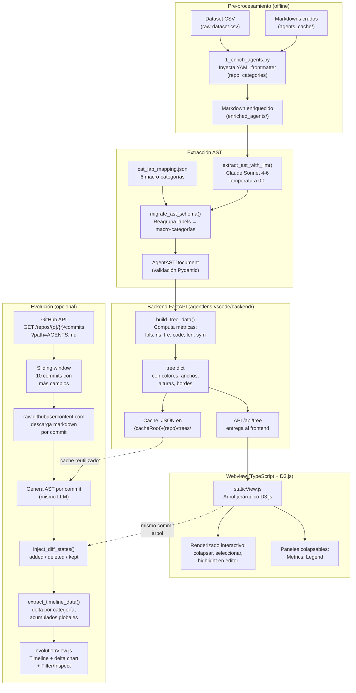

# Pipeline de Extracción y Visualización de ASTs de Instrucciones de Agentes

## Resumen

Este documento describe el pipeline completo que transforma archivos Markdown (`AGENTS.md` / `CLAUDE.md`) de repositorios de código abierto en visualizaciones interactivas de árbol AST (Abstract Syntax Tree). El pipeline consta de 7 etapas: enriquecimiento de datos, extracción vía LLM, migración de esquema, validación, construcción del árbol con métricas, cacheo y renderizado D3.js.

El punto de partida son los archivos del paquete de réplica del estudio de \cite{chatlatanagulchai2025agent}, donde los autores recopilaron, etiquetaron y validaron manualmente categorías semánticas para cada archivo `AGENTS.md` de una muestra de repositorios. Este trabajo se apoya en ese etiquetado preexistente, inyectándolo como metadatos para guiar la extracción estructurada posterior.

---

## Diagrama de Flujo General



---

## Etapa 0: Enriquecimiento del Dataset

**Script:** `src/scripts/1_enrich_agents.py`

### Entrada
- `dataset/raw-dataset.csv`: Archivo CSV del paquete de réplica de \cite{chatlatanagulchai2025agent}. Cada fila representa un repositorio con columnas `repository_owner`, `repository_name` y múltiples columnas `Label*` que contienen las categorías semánticas validadas por los autores.
- `dataset/agents_cache/{owner}_{repo}.md`: Archivos Markdown descargados de cada repositorio.

### Proceso
1. Itera sobre cada fila del CSV.
2. Extrae los valores de todas las columnas `Label*` como lista de categorías.
3. Lee el archivo Markdown correspondiente.
4. Prependiza un bloque YAML frontmatter:

```yaml
---
repo: "owner/repo"
categories: ["System Overview", "Architecture", "Testing", ...]
---
```

### Salida
- `dataset/enriched_agents/{owner}_{repo}.md`: Markdown original con metadatos inyectados.

### Propósito
El frontmatter sirve como *ground truth* semántico para el LLM en la etapa siguiente. Las categorías ya fueron validadas por el estudio original, eliminando la necesidad de clasificación desde cero.

---

## Etapa 1: Extracción del AST vía LLM

**Archivo:** `agentlens-vscode/backend/llm_service.py` — función `extract_ast_with_llm()`

### Entrada
- Archivo Markdown enriquecido con YAML frontmatter.

### Proceso
1. Se lee el contenido completo del archivo.
2. Se envía a Anthropic Claude (modelo `claude-sonnet-4-6`) con `temperature=0.0` para maximizar determinismo.
3. El *system prompt* contiene:
   - Las 16 categorías de etiquetas predefinidas con sus descripciones (ver abajo). Todo extraído directamente de \cite{chatlatanagulchai2025agent}.
   - Instrucciones para extraer reglas como fragmentos textuales **idénticos y literales** del original.
   - El esquema JSON exacto de salida.

### Categorías de Etiquetas (Labels)

| Categoría | Descripción |
|-----------|-------------|
| System Overview | Visión general del sistema |
| AI Integration | Instrucciones sobre comportamiento de IA |
| Documentation | Documentos, enlaces y referencias |
| Architecture | Estructura de alto nivel y principios de diseño |
| Impl. Details | Detalles de implementación y guías de estilo |
| Build and Run | Compilación y ejecución |
| Testing | Procedimientos de testing automatizado |
| Conf.&Env. | Configuración y entorno |
| DevOps | Despliegue, CI/CD y operaciones |
| Development Process | Flujo de trabajo y control de versiones |
| Project Management | Planificación y organización del proyecto |
| Maintenance | Mantenimiento y resolución de bugs |
| Debugging | Manejo de errores y debugging |
| Performance | Rendimiento y optimización |
| Security | Seguridad y vulnerabilidades |
| UI/UX | Interfaz de usuario y experiencia |

### Esquema de Salida del LLM

```json
{
  "projectInfo": {
    "repoName": "owner/repo",
    "agentsMdSource": "owner_repo.md"
  },
  "rootNode": {
    "id": "root",
    "label": "AGENTS.md Context",
    "type": "root",
    "children": [
      {
        "id": "cat_system_overview",
        "label": "System Overview",
        "type": "category",
        "count": 5,
        "children": [
          {
            "id": "rule_1",
            "type": "rule",
            "content": {
              "text": "The application must handle...",
              "originalHeader": "## Architecture"
            },
            "metadata": {
              "strength": "MUST",
              "format": "ListItem",
              "line_start": 42,
              "line_end": 43
            }
          }
        ]
      }
    ]
  }
}
```

### Propiedades de cada regla extraída
- **`text`**: Fragmento textual exacto del markdown original.
- **`strength`**: `MUST` (obligatorio) o `SHOULD` (recomendación).
- **`format`**: `ListItem` (viñeta) o `Paragraph` (párrafo).
- **`line_start/line_end`**: Líneas de inicio y fin en el documento original.

---

## Etapa 1b: Migración del Esquema (Labels → Macro-Categorías)

**Archivo:** `agentlens-vscode/backend/llm_service.py` — función `migrate_ast_schema()`

### Problema
El LLM agrupa reglas directamente bajo etiquetas (labels), pero para la visualización se necesita una jerarquía de 3 niveles: **Macro-Categoría → Label → Regla**.

### Solución
Se utiliza `cat_lab_mapping.json` para mapear cada label a una de 6 macro-categorías definidas en el paper \cite{chatlatanagulchai2025agent}:

```json
{
  "General": ["System Overview", "AI Integration", "Documentation"],
  "Implementation": ["Architecture", "Implementation Details"],
  "Build": ["Build & Run", "Testing", "Configuration & Environment", "Conf.&Env.", "DevOps"],
  "Management": ["Development Process", "Project Management"],
  "Quality": ["Maintainability", "Maintenance", "Debugging", "Performance", "Security", "UI/UX"]
}
```

Si un label extraído por el LLM no coincide exactamente, se usa `difflib.get_close_matches()` para encontrar el más cercano (corte de similitud ≥ 60%). Si no hay coincidencia, se asigna a `"Uncategorized"`.

### Resultado
El AST se reestructura de:

```
root → [Label → Rule, Label → Rule, ...]
```

a:

```
root → [Macro-categoría → [Label → Rule, Label → Rule], ...]
```

### Colores de Macro-Categorías

| Categoría | Color | Hex |
|-----------|-------|-----|
| General | Rojo | `#E41A1C` |
| Implementation | Púrpura | `#984EA3` |
| Build | Azul | `#377EB8` |
| Management | Naranja | `#FF7F00` |
| Quality | Verde | `#4DAF4A` |
| Uncategorized | Gris claro | `#e2e8f0` |

---

## Etapa 2: Validación Pydantic

**Archivo:** `agentlens-vscode/backend/domain_models.py` — clase `AgentASTDocument`

### Proceso
1. El JSON migrado se valida contra el modelo Pydantic `AgentASTDocument`.
2. Durante la validación, el constructor `__init__` ejecuta `rootNode.hydrate_tree()` que:
   - Inyecta `parent_id` y `parent_color` en cada nodo (categoría → label → regla).
   - Calcula `area_ratio` para cada label (normalización min-max del área visual), usado para interpolar la luminosidad HSL del color.
3. Cada entidad del dominio expone propiedades computadas:

### Propiedades Computadas por Nivel

| Nodo | Propiedad | Cálculo |
|------|-----------|---------|
| **Category** | `tree_width` | `140 + labels × 25` (cap 265px) |
| | `tree_height` | `50 + total_rules × 8` (cap 150px) |
| | `border_width` | `2.0 + code_ratio × 4.0` (cap 10px) |
| | `color` | Color fijo de la macro-categoría |
| **Label** | `tree_width` | `180 - FRE score` (range 80-180px) |
| | `tree_height` | `40 + rules × 10` (cap 120px) |
| | `border_width` | `2.0 + code_ratio × 4.0` (cap 10px) |
| | `color` | Color heredado de categoría padre con luminosidad interpolada por `area_ratio` |
| | `computed_fre_score` | Flesch Reading Ease del texto concatenado de reglas hijas (vía `textstat`) |
| | `code_ratio` | Fracción de reglas que contienen marcadores de código |
| **Rule** | `tree_width` | `120 + chars × 2.5` (range 120-400px) |
| | `tree_height` | `36 + special_chars × 6` (cap 120px) |
| | `color` | Color del label padre con luminosidad fija 22% (contraste tipográfico) |
| | `special_chars_count` | Conteo de `{}[]()<>/\`#*+-=|@_` |
| | `short_label` | Primeros 30 caracteres del texto |

### Codificación Geométrica (Visual Mapping)

El ancho y alto de cada rectángulo en el árbol transmite información semántica:

- **Ancho de Category**: Diversidad temática (más labels = más ancho).
- **Alto de Category**: Volumen de reglas (más reglas = más alto).
- **Ancho de Label**: Legibilidad (FRE alto = fácil de leer = ancho pequeño; FRE bajo = denso = ancho grande).
- **Alto de Label**: Cantidad de reglas.
- **Ancho de Rule**: Longitud del texto.
- **Alto de Rule**: Densidad de símbolos de programación.
- **Borde**: Proporción de reglas con código (`code_ratio`), de 2px a 10px.

---

## Etapa 3: Construcción del Árbol con Métricas

**Archivo:** `agentlens-vscode/backend/ast_service.py` — función `build_tree_data()`

### Entrada
- Objeto `AgentASTDocument` validado.

### Proceso
1. Se recopilan todas las longitudes de reglas para calcular `min_len` y `max_len`.
2. Se normaliza el ancho de cada regla: `120 + ((len - min) / (max - min)) × 230`.
3. Se recorren categorías, labels y reglas extrayendo:
   - Métricas por nivel (ver tabla abajo).
   - Propiedades geométricas (`width`, `height`, `color`, `border_width`).
   - `details`: HTML con información detallada para el tooltip/hover.
   - `raw_text`: Texto completo de la regla (usado para highlight en editor).

### Métricas Expuestas

| Nodo | Métricas |
|------|----------|
| **Category** | `lbls` (cantidad de labels), `rls` (reglas totales), `code` (code ratio) |
| **Label** | `rls` (reglas), `fre` (Flesch Reading Ease), `code` (code ratio) |
| **Rule** | `len` (caracteres), `sym` (símbolos especiales) |

### Salida
- Diccionario `tree` listo para serializar a JSON y consumir por el frontend.

---

## Etapa 4: Cacheo

**Archivo:** `agentlens-vscode/backend/cache_manager.py`

### Ubicación
Por defecto: `~/.agentlens/{repo_name}/trees/{file}.json`

Configurable via variable de entorno `AGENTLENS_CACHE_ROOT`.

### Estructura

```
{AGENTLENS_CACHE_ROOT}/
├── {owner}_{repo}/
│   ├── trees/
│   │   └── {file}.json              ← AST estático
│   └── evolution/
│       ├── file_history.json        ← Historial de commits
│       └── trees/
│           ├── {sha1}.json          ← AST por commit
│           ├── {sha2}.json
│           └── ...
```

### Propósito
- Evita regenerar ASTs vía LLM (costoso en tiempo y tokens).
- Los ASTs precomputados se incluyen en `agentlens-vscode/cache/` para que la extensión funcione sin conexión a internet ni API keys.

---

## Etapa 5: Evolución (Timeline + Diff)

**Archivo:** `agentlens-vscode/backend/main.py` — endpoint `/api/evolution`

### Obtención del Historial
1. El filename (`cartography-cncf_cartography.md`) se parsea como `{owner}_{repo}` → `cartography-cncf` / `cartography`.
2. Se detecta automáticamente si el archivo remoto es `AGENTS.md` o `CLAUDE.md`.
3. Se consulta la GitHub API: `GET /repos/{owner}/{repo}/commits?path=AGENTS.md`.
4. Se aplica **sliding window de 10 commits**: se seleccionan los 10 commits con mayor suma de `additions + deletions` (cambios en el archivo objetivo). Esto limita el gasto de tokens LLM.

### Generación de ASTs por Commit
1. Para cada commit en la ventana, se descarga el contenido raw desde `raw.githubusercontent.com/{owner}/{repo}/{sha}/{path}`.
2. Se genera el AST vía LLM (misma función `extract_ast_with_llm`), cacheándolo en `evolution/trees/{sha}.json`.

### Cómputo de Diffs
La función `inject_diff_states(prev_tree, curr_tree)` compara dos ASTs consecutivos:

1. Obtiene todos los nodos (reglas, labels, categorías) como mapa plano con `get_flat_nodes()`.
2. Para cada nodo en el árbol actual:
   - Si no existe en el anterior → `diff_status: "added"`.
   - Si existe → `diff_status: "kept"`.
3. Para cada nodo en el árbol anterior que no existe en el actual → se inyecta como nodo fantasma (ghost) con `diff_status: "deleted"` y todos sus hijos marcados recursivamente como eliminados.

### Extracción de Timeline
La función `extract_timeline_data()` procesa la secuencia de commits:

- Por cada commit, calcula:
  - **Global delta**: reglas y labels agregadas/eliminadas.
  - **Delta por categoría**: desglose de cambios por macro-categoría.
  - **Acumulados**: suma acumulada de cambios a lo largo del timeline.

---

## Etapa 6: Visualización

### Vista Estática (`staticView.js`)
- Árbol jerárquico renderizado con D3.js (`d3.tree()`).
- **Colapso/expansión**: Cada nodo es clickeable para colapsar sus hijos.
- **Selección de regla**: Click en un nodo rule → se marca visualmente (borde azul + drop-shadow) y se resalta el texto correspondiente en el editor Markdown (decoración estilo linter: fondo amarillo, borde, overview ruler).
- **Paneles colapsables**: Los paneles "Metrics" y "Legend" se reducen a un badge pill al hacer click en el header.
- **Métricas en badges**: Cada nodo muestra sus métricas (LBL/RUL/COD/FRE/LEN/SYM) como badges.

### Vista de Evolución (`evolutionView.js`)
- **Timeline slider**: Navegación cronológica entre commits (posición 0 = más antiguo).
- **Árbol con diff**: Los nodos se colorean según `diff_status`: verde (added), rojo (deleted), gris (kept).
- **Delta chart**: Gráfico de barras apiladas por categoría ("Added vs Deleted"), colapsable a badge.
- **Modos de interacción**:
  - **Filter**: Click en categoría del delta chart → filtra el árbol y actualiza el gráfico mostrando solo esa categoría.
  - **Inspect**: Click en nodo del árbol → muestra detalles completos de la regla en panel lateral; doble click en categoría → colapsa/expande.

---

## Flujo Completo de la Extensión VSCode

```
Usuario abre .md         Usuario ejecuta            Backend verifica
en el editor             "AgentLens: Show           caché en filesystem
                         AST Visualization"
      │                        │                          │
      ▼                        ▼                          ▼
┌────────────┐         ┌──────────────┐          ┌────────────────┐
│ Activación  │──────→  │ backend.start() │────→  │ GET /api/tree  │
│ extension.ts│         │ spawn Python    │       │ busca en caché │
└────────────┘         │ FastAPI :8765   │       └───────┬────────┘
                        └──────────────┘               │
                                                  ┌─────▼─────┐
                                                  │ ¿En caché? │
                                                  └──┬───┬─────┘
                                            Sí (cached) │ │ No (not_found)
                                                    │   │
                                                    ▼   ▼
                                            ┌──────────────┐
                                            │ GET /api/     │
                                            │ generate      │
                                            │ → LLM → cache │
                                            └──────┬───────┘
                                                   │
                                                   ▼
                                            ┌──────────────┐
                                            │ build_tree_   │
                                            │ data()        │
                                            │ → tree JSON   │
                                            └──────┬───────┘
                                                   │
                                                   ▼
┌──────────────────────────────────────────────────────┐
│  Webview (D3.js) recibe tree JSON                    │
│  ┌──────────────────────────────────────────────┐    │
│  │  staticView.js                               │    │
│  │  Árbol jerárquico + métricas + highlight     │    │
│  └──────────────────────────────────────────────┘    │
│  ┌──────────────────────────────────────────────┐    │
│  │  evolutionView.js (si hay historial)          │    │
│  │  Timeline + diff + delta chart                │    │
│  └──────────────────────────────────────────────┘    │
└──────────────────────────────────────────────────────┘
```

---

## Referencias

- \cite{chatlatanagulchai2025agent}: Estudio original que recopiló y etiquetó el dataset de archivos AGENTS.md. El paquete de réplica contiene tanto los archivos markdown descargados como las categorías validadas para cada repositorio.
- Repositorio del proyecto: [https://github.com/CQuarkH/agentlens-vscode](https://github.com/CQuarkH/agentlens-vscode)
- Modelo LLM: Anthropic Claude Sonnet 4-6 (`claude-sonnet-4-6`)
- Visualización: D3.js v7 (`d3.tree()`)
- Backend: FastAPI + Pydantic v2
